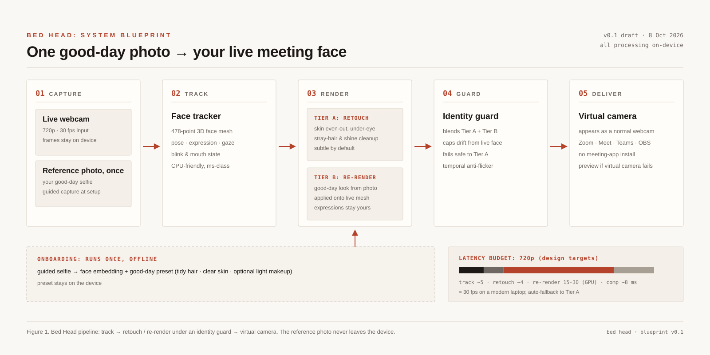

# bedhead

**Look presentable on video calls.** Bed Head is a Tier A "good-day" filter: it tracks your face with a 478-point mesh and applies corrective retouch (skin, under-eyes, shine, teeth, hairline), then publishes the result to a virtual camera your meeting app already knows.

> You, but on a good day. Not someone else.



## Status

P0.5 (Python). Tier A retouch rebuilt on a research-grade quality engine, plus the parity features (background modes, person relight, eye light) and a guarded Tier B generative spike (not real-time; see below); see [`docs/ROADMAP.md`](docs/ROADMAP.md).

- ✅ MediaPipe 478-point face tracking (VIDEO mode, ~5 ms/frame standalone measurement; ~31-45 ms full pipeline on the live bench), one-euro smoothed
- ✅ Quality-engine retouch: guided-filter frequency separation, LAB pipeline, guided-filter-base shine compression, hysteresis teeth gate, selective sharpening (~9 ms/frame for the face-ROI effects at 720p on Apple Silicon)
- ✅ Reference-guided: identity-gated gallery reference, autotune, continuous ambient adaptation, Reinhard color match (~4.6 ms/frame, cached reference stats)
- ✅ Measured under-eye correction: landmark-keyed tear-trough band (convex-hull geometry, below-lash-line start), darkness-proportional dodge
- ✅ Subject pop: continuous background darken from live-vs-reference background L* (studio preset arms it; LookTracker adapts it)
- ✅ Detail boost + vibrance (face-oval ROI, L*-preserving LAB chroma): webcam-soft faces sharpened ~114% HF retention, dull skin resaturated without touching luma
- ✅ Person segmentation (selfie-multiclass): true person masks, EMA-smoothed, every-3rd-frame
- ✅ Background blur / darken (Zoom Portrait / NVIDIA-class, feathered composite)
- ✅ Studio Light: relight the person only, background untouched (Apple Continuity-class)
- ✅ Eye light: landmark-gated brightness for an awake look
- ✅ 8-metric quality benchmark (bedhead/benchmark.py): under-eye gap, texture retention, color dE, exposure, subject pop, saturation, temporal pump, latency, all measured live against your reference photo
- ✅ Identity preservation verified: 43/43 VidTIMIT subjects, 3,512 frames, retouched faces still match their profile picture (mean SFace cosine 0.83 vs 0.363 threshold; no frame degrades below its original)
- ✅ Virtual camera output via OBS (macOS: obs-mac-virtualcam; Windows: pyvirtualcam on the OBS virtual camera driver that ships with OBS Studio)
- ✅ Preview window with A/B toggle + keyboard dials (incl. k/i/b/n for the new effects)
- ✅ Live control panel (`bedhead.panel`) with preset hot-reload
- ✅ Headless test suite + CI (ruff + pytest, 3.10–3.13)
- ✅ Standalone binary: PyInstaller one-file build ([docs/PACKAGING.md](docs/PACKAGING.md)),
  CI builds and clean-machine-smokes it every push
- ✅ Installers: macOS `.pkg` (pkgbuild, notarize-ready) + Windows Inno Setup
  `.exe` (per-user, PATH, uninstaller); both CI-built and smoke-tested
- ⏳ Tier B generative re-render (LivePortrait-class; research says Core ML/ANE only, not CPU)
- 🧪 Tier B spike SHIPPED (guarded): `bedhead --reference you.jpg --tier-b` runs IN Swapper
  under the full guard contract (admitted-reference-only, drift-capped every 10 frames,
  progressive fail-safe: blend halves before disable, fail-safe to Tier A, `g` blend dial).
  Frequency-separable composite keeps native-resolution skin texture (HF = raw exactly).
  CoreML-assisted ~64-76 ms/frame on
  Apple Silicon (CPU-only 205 ms; fp16 a measured regression); real-time
  needs a full ANE/GPU engine port (P1). 256px hyperswap evaluated and
  closed (see [docs/TIERB-256-EVAL.md](docs/TIERB-256-EVAL.md)).
- ⏳ Native macOS app + CMIO camera extension

## Quick start

### Install (no Python needed)

Download the installer for your platform from the latest CI artifacts (or
[Releases](https://github.com/pamu512/bedhead/releases) once published):

- **macOS** (arm64): `bedhead-<version>-macos.pkg`. Double-click; installs
  `bedhead` into `/usr/local/bin`. First run asks for Camera permission and
  downloads the models (~20 MiB) once.
- **Windows** (x64): `bedhead-<version>-windows-x64.exe`. Per-user install,
  adds `bedhead` to your PATH (new terminals), Start-menu shortcuts,
  clean uninstaller.

Build them yourself from source: see [docs/PACKAGING.md](docs/PACKAGING.md)
(`scripts/build_mac_installer.sh`, `installer/bedhead.iss`; both CI-built
and smoke-tested on every push).

### Or run from source

```bash
# 1) clone and enter
git clone https://github.com/pamu512/bedhead.git
cd bedhead

# 2) install (Python 3.10–3.13)
uv venv && uv pip install -e .
#    (or: python3.12 -m venv .venv && .venv/bin/pip install -e .)

# 1b) macOS screen-recording permission: System Settings → Privacy & Security
#     → Screen Recording → allow Terminal (or your terminal app). Camera permission too.

# 3) run preview only (no OBS needed)
bedhead

# 3b) face-only, skip the clothes segmenter
bedhead --no-clothes

# 4) run with virtual camera (macOS: install OBS first; see below)
bedhead --cam

# 5) the full stack: reference-guided, identity-guarded
bedhead --reference you.jpg --auto-match --tier-b

# 6) optional live control panel (separate terminal, sliders apply live)
python -m bedhead.panel
```

First run downloads the MediaPipe face-landmarker model (3.7 MiB) into your user cache directory (`~/Library/Caches/bedhead` on macOS, `~/.cache/bedhead` on Linux), verified against a pinned sha256. The selfie segmenter (16.4 MiB) is fetched on first use of a segmentation feature (background/studio light/subject pop, or clothes tidy-up, which is on by default. `--no-clothes` skips it, so a plain `bedhead` run downloads both models).

### macOS virtual camera setup (OBS path)

`pyvirtualcam` on macOS needs OBS Studio with the obs-mac-virtualcam plugin:

1. Install OBS Studio 30+ (brew install --cask obs or obs-28+ with plugin bundled... see below).
2. In OBS: Tools → Start Virtual Camera.
3. bedhead will now find "OBS Virtual Camera". In Zoom/Meet/Teams pick **OBS Virtual Camera** as your camera.

Windows: pyvirtualcam uses the native OBS virtual camera driver (ships with OBS install). No plugin gymnastics.

### Keys (preview window)

| Key | Action |
| --- | --- |
| `q` / `Esc` | quit |
| `space` | toggle original / retouched in the **preview only** (the virtual camera keeps receiving the retouched frame) |
| `0`–`9` | set global intensity (0 to 100% in 1/9 steps) |
| `s` / `e` / `h` / `t` / `l` | skin / under-eye / shine / teeth / soft-light +0.1 (wraps) |
| `k` / `i` | studio light / eye light +0.1 (wraps) |
| `b` / `n` | background strength +0.2 (wraps) / cycle background mode off→blur→dark |
| `m` | color-match (reference) +0.2 (wraps) |
| `r` | toggle the reference photo overlay (picture-in-picture, top-right) |
| `g` | Tier B blend: 0 → 0.25 → 0.50 → 0.75 → 1.00 → off (guarded; fails safe to Tier A) |

Keyboard edits are saved to `~/.bedhead/preset.json` and the Tk panel picks them up (and vice versa).

### Named presets

| Preset | What it does |
| --- | --- |
| `subtle` | light retouch (intensity 0.4) |
| `rescue` | full retouch (intensity 0.8) |
| `studio` | retouch + studio light + eye light + subject pop + blurred background |
| `focus` | light retouch + darkened background with subject pop (all attention on you) |

### Reference photo (identity-guarded)

Tier B features take a reference photo, and it can come from your gallery:

```
bedhead --reference ~/Pictures/good-day.jpg
```

The reference is only used after it passes an on-device admission check: bedhead samples ~15 live frames, embeds the face on camera and the face in the photo (ArcFace), and requires cosine similarity >= 0.40 (calibrated in `bedhead/guard.py`: same-person pairs 0.73 to 0.78, cross-person pairs -0.04 to 0.06). A photo of someone else is rejected and the run continues Tier-A-only. Requires the `guard` extra: `pip install 'bedhead[guard]'`.

**Tier B spike (guarded generative re-render)**: with an admitted reference, `--tier-b` re-renders your face from that reference (IN Swapper). The guard contract is enforced in code: only an admitted reference can ever be registered as the identity source, output identity is re-checked every 10 frames against the reference (drift cap 0.35; measured 0.95 on a genuine reference), and any violation fails safe to Tier A. The `g` key blends Tier A <-> Tier B. Perf is CoreML-assisted (~64-76 ms/frame on Apple Silicon CPU+ANE partitioning; pure CPU is 205 ms; fp16 conversion is a measured regression on this CPU). Not real-time yet: that needs a full ANE/GPU engine port (P1). One-time model: place `inswapper_128.onnx` in the model cache (see `bedhead/models.py` MODEL_DIR).

With `--auto-match`, the admitted reference also tunes the Tier A effects: bedhead measures the exposure/warmth/sharpness gap between the live feed and the reference photo and derives `soft_light` / `studio_light` / `under_eye` / `skin` strengths that move your live look toward the photo's look (classical effects only, nothing generative):

```
bedhead --reference ~/Pictures/good-day.jpg --auto-match
```

Auto-match also enables **reference color match** (the `m` key dials it live): a Reinhard LAB statistics transfer that moves your face's color toward the reference photo's, inside the face oval only, chroma-clamped so skin can never shift into unnatural hues. Measured on a 0.55x-exposure "bad webcam" frame, it closes 42% of the total look gap on top of the Tier A stack (45% in the first measurement, 42% on the remeasure), while identity drift stays at 0.90 similarity (cap 0.35), because the transfer changes color statistics only, never geometry.

## How it works
```
webcam ──► MediaPipe FaceLandmarker ──► Tier A retoucher ──► virtual camera (OBS)
                (478 pts, ~5 ms)         (skin/eye/shine/      (Zoom/Meet/Teams
                                         teeth/hair/light)      see a webcam)
```

| Stage | Module | What it does | Fail-safe |
|-------|--------|--------------|-----------|
| Track | `bedhead/tracker.py` | 478-point mesh + blendshapes (jawOpen gates teeth) | No face → frame passes through untouched |
| Retouch | `bedhead/retoucher.py` | Feathered, landmark-masked effects; all strengths 0–1, capped | Effects at 0 skip their path (feature sharpening still runs at low strength while the face is retouched) |
| Deliver | `bedhead/sinks.py` | Preview window and/or pyvirtualcam sink | vcam open fails → preview-only, never crash |
| Control | `bedhead/cli.py` + `panel.py` | Keyboard dials + Tk sliders; preset JSON hot-reload | none |

Every regional edit is feathered and clamped; nothing drifts: the output is your frame with bounded corrections, never a generated face (that's Tier B, guarded).

## Quality engine (v2)

The retouch core was rebuilt around research-grounded techniques (see `bedhead/quality.py`):

| Technique | What it does | Source |
| --- | --- | --- |
| Guided-filter frequency separation | smooths only mid-frequency blemishes on the L channel; pores and edges survive (no plastic look) | He et al., ECCV 2010 |
| One-Euro landmark filtering | kills landmark jitter (the #1 "cheap filter" tell) with near-zero lag on motion | Casiez & Roussel, CHI 2012 |
| LAB color pipeline | all corrections on luminance; chroma untouched (except deliberate teeth desat) | standard pro-retouch practice |
| Local-percentile shine | specular highlights found vs the LOCAL smooth base, works across skin tones | intrinsic-decomposition practice |
| Hysteresis gates | jaw-open Schmitt trigger stops the teeth effect flickering at half-open | classical |
| Selective unsharp | eyes/lips/brows sharpened via the high-frequency residual, skin left smooth | pro workflow |

Optional segmentation effects (`bedhead.segmenter`, downloads its model on first use): background blur/darken, Studio Light (person-only relight), eye light, and true-skin masking that refines the landmark oval (handles hair strands, glasses).

## Identity preservation benchmark

`scripts/identity_check.py` verifies the retouch never changes who you are. On the Kaggle [VidTIMIT](https://www.kaggle.com/datasets/crazyt/vidtimit-audiovideo-dataset) dataset (43 subjects; first frame per subject acts as the profile picture, all other clips are retouched at "rescue" strength):

- mean SFace cosine similarity retouched-vs-profile: **0.83** (match threshold 0.363)
- every one of the 3,512 processed frames scores at least as well as its unretouched original (max degradation 0.03, within noise)

Run it yourself:

```bash
kaggle datasets download crazyt/vidtimit-audiovideo-dataset -p vidtimit --unzip
python scripts/identity_check.py --frames-root vidtimit --preset rescue
```

## Repo layout

```
bedhead/
├── bedhead/            # Python package
│   ├── cli.py          # entrypoint: bedhead …
│   ├── tracker.py      # MediaPipe face mesh (one-euro smoothed)
│   ├── retoucher.py    # Tier A effects (LAB + guided-filter engine)
│   ├── quality.py      # one-euro filter, hysteresis, frequency separation
│   ├── lighting.py     # studio light / eye light / background / face lift
│   ├── autotune.py     # reference autotune + LookTracker (continuous adapt)
│   ├── colormatch.py   # Reinhard LAB color match to the reference
│   ├── segmenter.py    # person/skin/hair segmentation (amortized)
│   ├── guard.py        # ArcFace identity guard (reference admission)
│   ├── tierb.py        # guarded generative re-render (IN Swapper)
│   ├── freqblend.py    # frequency-separable Tier B composite
│   ├── benchmark.py    # 8-metric quality benchmark
│   ├── aelock.py       # native camera exposure lock (external cams)
│   ├── clothes.py      # garment tidy-up (crease soften, stain fade, logo blur)
│   ├── keys.py         # key-binding helpers shared by preview/panel
│   ├── sinks.py        # preview + virtual camera
│   ├── panel.py        # Tk live control panel
│   ├── config.py       # Preset dataclass + named presets
│   └── models.py       # one-time model download (sha256-pinned)
├── installer/bedhead.iss   # Windows Inno Setup installer
├── scripts/            # mac installer, notarize, identity benchmark, fairness fixtures
├── tests/              # headless test suite (+ live_camera marker)
├── docs/               # ROADMAP, PACKAGING, TIERB-256-EVAL, product brief
└── assets/             # architecture figure
```

## Configuration

All knobs live in `bedhead/config.py` (`Preset` dataclass). The panel writes `~/.bedhead/preset.json`; the CLI hot-reloads it every second. Named presets: `bedhead --preset subtle` (0.4) or `rescue` (0.8).

## Roadmap

See [`docs/ROADMAP.md`](docs/ROADMAP.md).

## Privacy

Frames never leave the machine. Models download from Google's public MediaPipe store once. No telemetry, no cloud, no analytics. Tier B will process on-device too.

## License

MIT (see [LICENSE](LICENSE)). The identity-guard IP planned for Tier B will be reviewed separately before any Series A conversations.
